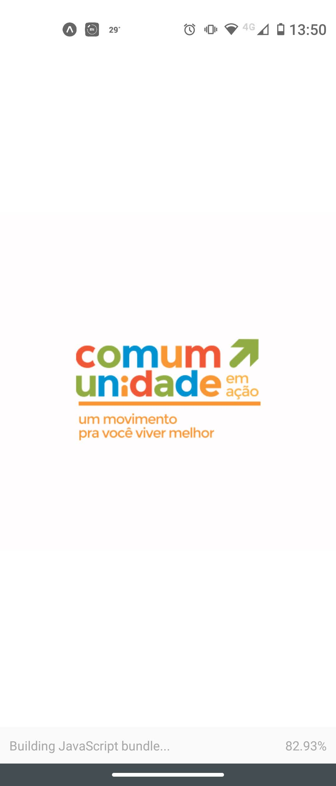
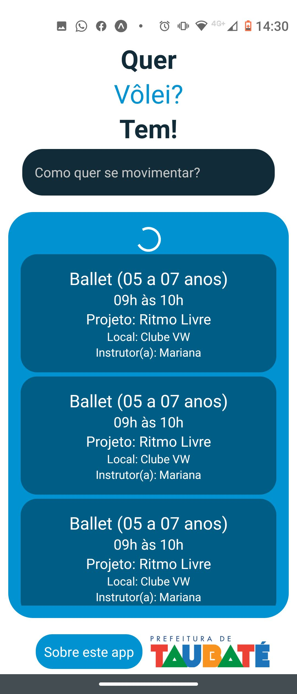

# Aplicativo do Programa Comum-Unidade em Ação

O objetivo do desenvolvimento do aplicativo é o de adição a portfólio pessoal, além de propôr parceria de cessão voluntária do código fonte 
para a Prefeitura Municipal de Taubaté.

## Ambiente de desenvolvimento *Front End*
Foi utilizado o *framework* React Native para o desenvolvimento do aplicativo, com o auxílio do Expo.
Não foi necessário uso de nenhuma dependência adicional.

O aplicativo funciona no modo *single page*, com o componente <code>App</code> importando os outros componentes e formando um só módulo.

**Quer testar localmente?** Enquanto o app não é disponibilizado na Google Play Store, você pode clonar este repositório e com o comando 
<code>npm i</code> instalar as dependências. Depois, basta digitar <code>npm start</code> e a interface do Expo iniciará.

> Você consegue testar localmente em simuladores Android, iOS ou até mesmo no navegador. Ah, também dá pra usar o QR Code no app Expo.

### *Screenshots*

